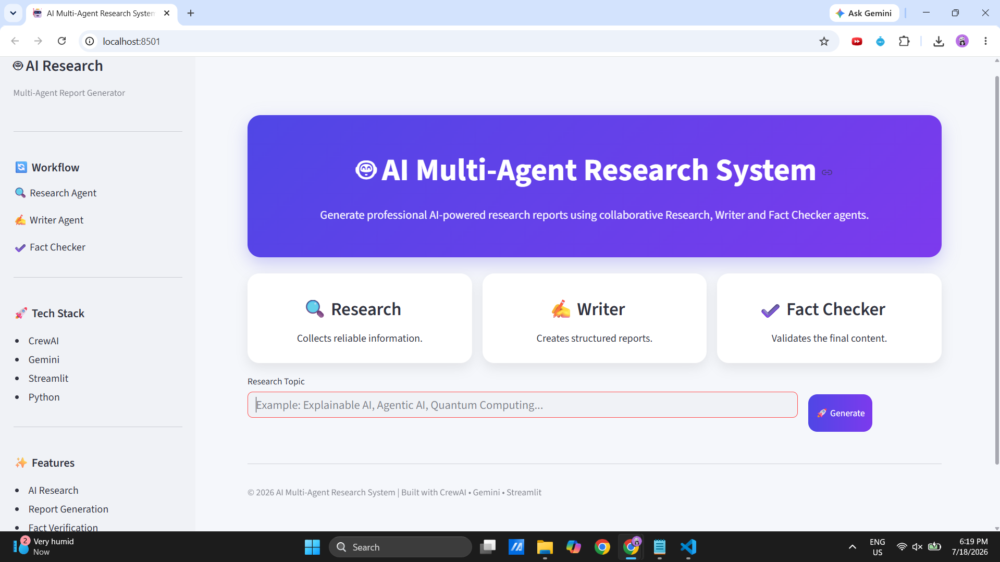
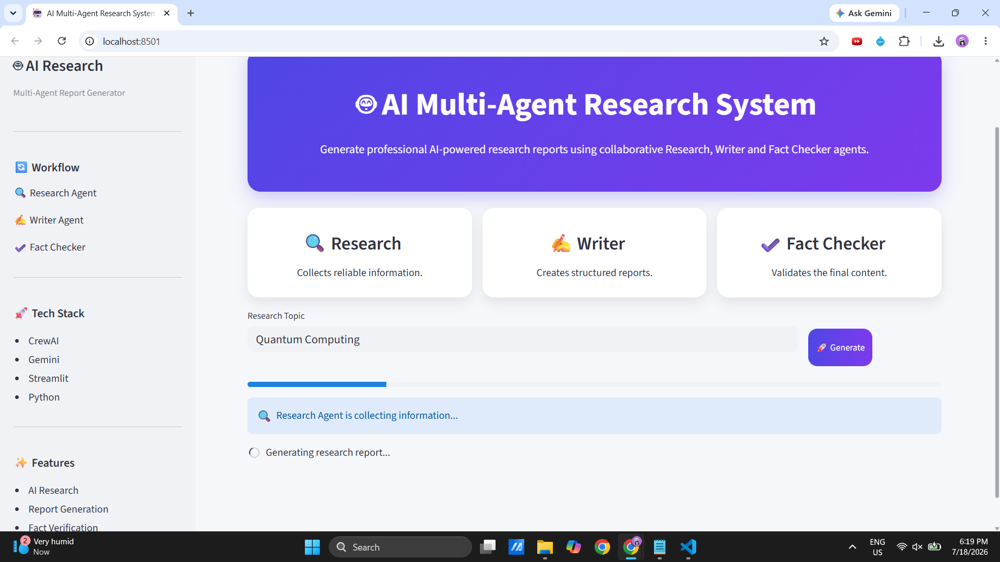
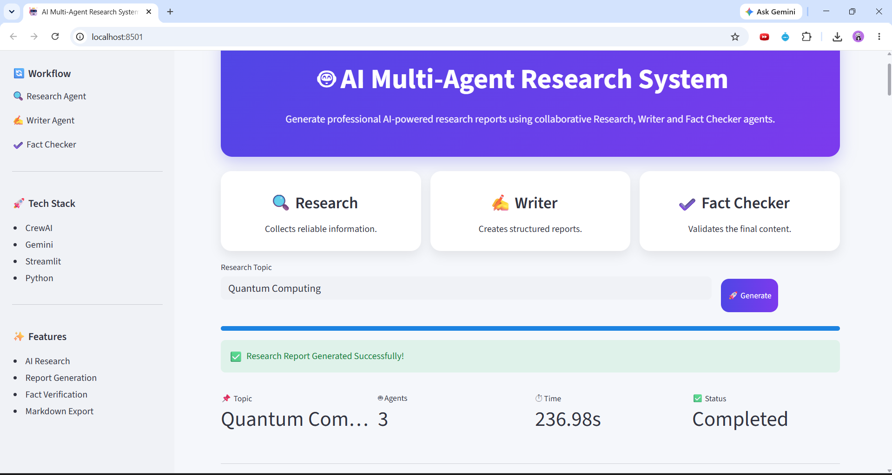
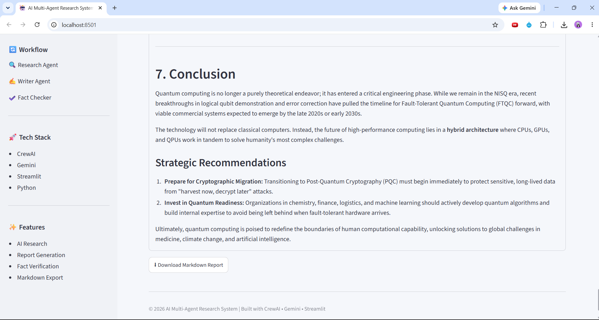
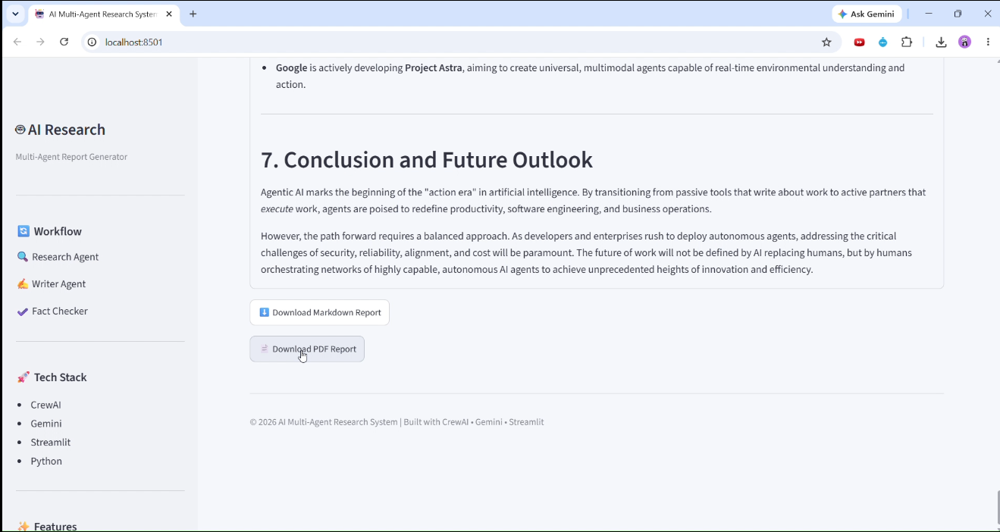

# 🤖 AI Multi-Agent Research & Report Generation System

An AI-powered research assistant that leverages a multi-agent workflow to research a topic, generate a structured report, and verify its accuracy before producing the final output.

Built using **CrewAI**, an LLM integration layer, **Google Gemini**, and **Streamlit** to orchestrate specialized AI agents that collaborate to produce high-quality research reports.

---


## 🚀 Features

- 🔍 Research topics using a dedicated AI Research Agent
- ✍️ Generate well-structured reports with a Writer Agent
- ✅ Verify generated content using a Fact Checker Agent
- 🤝 Sequential multi-agent collaboration using CrewAI
- 📄 Automatically generate Markdown research reports
- 🌐 Interactive Streamlit web interface
- 📥 Download generated reports

---

```
- 🧠 Role-based AI agents with specialized responsibilities
- 🔄 Sequential task orchestration using CrewAI
```
## 🏗️ System Architecture

```
                User
                  │
                  ▼
         Streamlit Web UI
                  │
                  ▼
           run_research()
                  │
                  ▼
      ┌───────────────────────┐
      │   Research Agent      │
      └───────────────────────┘
                  │
                  ▼
      ┌───────────────────────┐
      │    Writer Agent       │
      └───────────────────────┘
                  │
                  ▼
      ┌───────────────────────┐
      │  Fact Checker Agent   │
      └───────────────────────┘
                  │
                  ▼
        Markdown Research Report
```

---

## 📂 Project Structure

```
multi-agent-research-system/
│
├── agents/
│   ├── research_agent.py
│   ├── writer_agent.py
│   └── fact_checker_agent.py
│
├── tasks/
│   ├── research_task.py
│   ├── writing_task.py
│   └── fact_check_task.py
│
├── tools/
│   └── search_tool.py
│
├── utils/
│   └── file_handler.py
│
├── output/
│
├── app.py
├── streamlit_app.py
├── requirements.txt
├── .env.example
└── README.md
```

---

## 🧠 AI Agents

### 🔍 Research Agent
- Conducts comprehensive research on the given topic
- Collects relevant facts and supporting information

### ✍️ Writer Agent
- Organizes research findings
- Produces a structured and readable report

### ✅ Fact Checker Agent
- Reviews the generated report
- Corrects inconsistencies and improves factual accuracy

---
## 🚀 Live Demo

🔗https://multi-agent-research-system-dzckcxwnnetmrjldjazuwf.streamlit.app/
## 🛠️ Tech Stack

- Python
- CrewAI
- Google Gemini
- LiteLLM
- Streamlit
- python-dotenv

---

## ⚙️ Installation

Clone the repository

```bash
git clone https://github.com/annavarapunavya/multi-agent-research-system.git
cd multi-agent-research-system
```

Create a virtual environment

```bash
python -m venv venv
```

Activate the environment

### Windows

```bash
venv\Scripts\activate
```

### Linux / macOS

```bash
source venv/bin/activate
```

Install dependencies

```bash
pip install -r requirements.txt
```

Create a `.env` file

```env
GEMINI_API_KEY=your_api_key
```

---

## ▶️ Run the Application

### Terminal Version

```bash
python app.py
```

### Streamlit Version

```bash
python -m streamlit run streamlit_app.py
```

---

## 📄 Sample Workflow

1. Enter a research topic.
2. Research Agent gathers information.
3. Writer Agent generates a structured report.
4. Fact Checker reviews and refines the report.
5. Download the final Markdown report.

---

## 🎯 Future Improvements

- Export reports as PDF
- Support multiple LLM providers
- Add citation generation
- Multi-language report generation
- Research history
- Real-time progress tracking

---

## 📸 Screenshots

### Home Screen



### AI Agents Working



### Output 

### Generated Report


### PDF Download of Generated report




---

## 📄 License

This project is licensed under the MIT License. See the LICENSE file for details.

## 👨‍💻 Author

**Annavarapu Navya**

B.Tech | AI & Machine Learning Enthusiast
